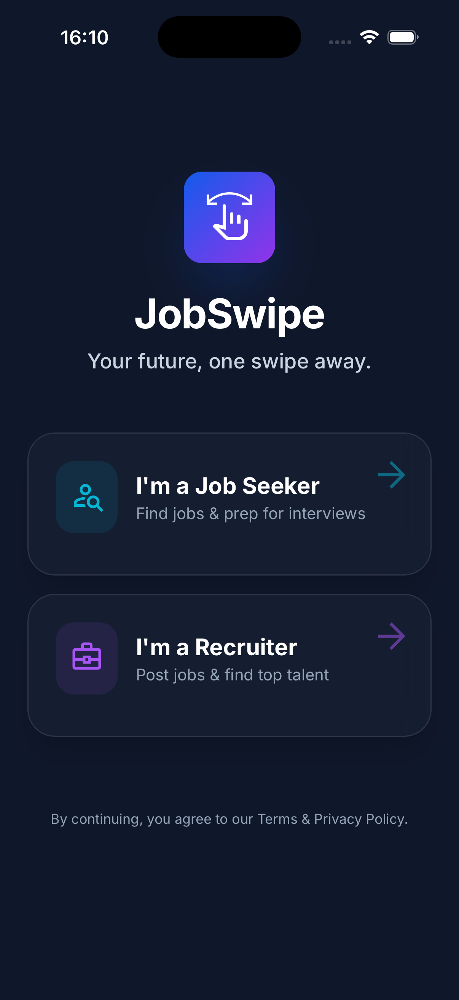
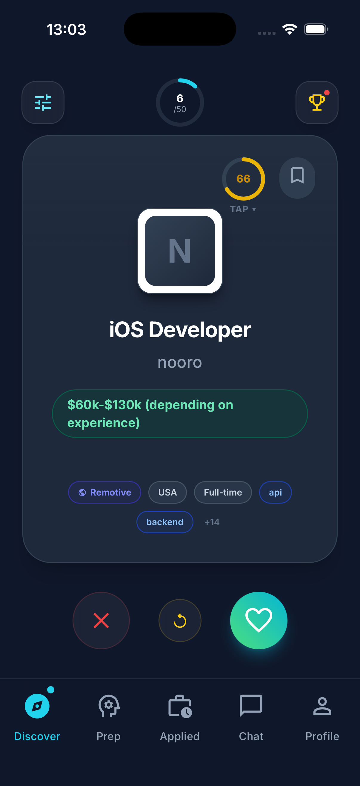
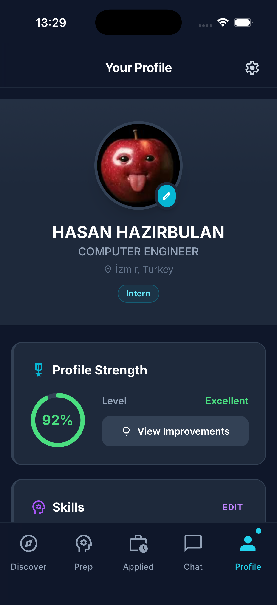
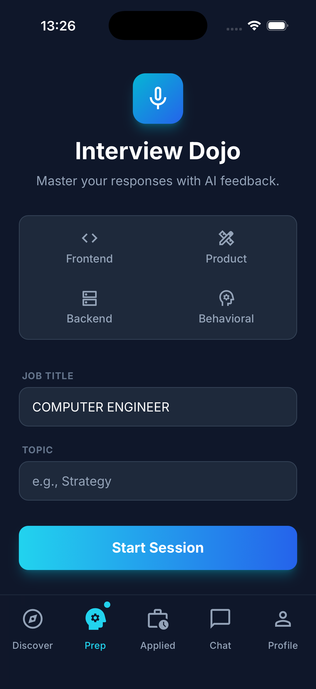

# 💼 JobSwipe — AI-Powered Job Matching Platform

> *Swipe right on your career.*


---

## 📌 Problem

Job searching is broken. Candidates scroll through hundreds of irrelevant listings. Recruiters drown in unqualified applications. Neither side has a feedback loop that improves over time.

## 💡 Solution

A swipe-based job matching platform where AI parses your CV, understands your preferences from your behavior, and continuously refines the jobs it shows you — like Tinder, but it actually finds you something useful.

---

## 📸 Screenshots

<p align="center">
  
  
</p>
<p align="center">
  
  
</p>

---

## ⚙️ Architecture

```
┌──────────────────────────────────────────┐
│         React + TypeScript (Web)         │
│         Capacitor (iOS / Android)        │
│                                          │
│  ┌────────────┐    ┌───────────────────┐ │
│  │ Swipe UI   │    │  Preference Engine│ │
│  │ (Candidate)│    │  (learns behavior)│ │
│  └─────┬──────┘    └────────┬──────────┘ │
└────────┼────────────────────┼────────────┘
         │                    │
         ▼                    ▼
┌──────────────────────────────────────────┐
│               Supabase                   │
│    Auth · PostgreSQL · Realtime          │
└────────────────────┬─────────────────────┘
                     │
                     ▼
┌──────────────────────────────────────────┐
│           Google Gemini API              │
│   CV parsing · Job recommendation        │
│   Semantic matching                      │
└──────────────────────────────────────────┘
```

## 🛠 Tech Stack

| Layer | Technology |
|---|---|
| Frontend | React, TypeScript |
| Mobile Wrapper | Capacitor |
| Backend / DB | Supabase (PostgreSQL, Auth, Realtime) |
| AI | Google Gemini API |
| Distribution | App Store · Google Play · Web |

---

## ✨ Key Features

- **AI CV Parsing** — Upload your CV, Gemini extracts skills, experience and builds your profile automatically
- **Swipe-based UX** — Intuitive card interface; swipe right to save, left to skip
- **Preference Learning** — Matching score improves with every swipe using behavioral signals
- **Multi-factor Scoring** — Jobs ranked by skills match, location, seniority, and learned preferences
- **Real-time Job Feed** — Listings update continuously

---

## 👥 Team

Built by a 2-person team.

| Member | Profile |
| :--- | :--- |
| **Gülfem Küpeli** | [@GulfemKupeli](https://github.com/GulfemKupeli) |
| **Hasan Hazırbulan** | [@hasanhazirbulan](https://github.com/hasanhazirbulan) |

---

## 🚀 Availability

Planned release on **App Store**, **Google Play**, and **Web**.
